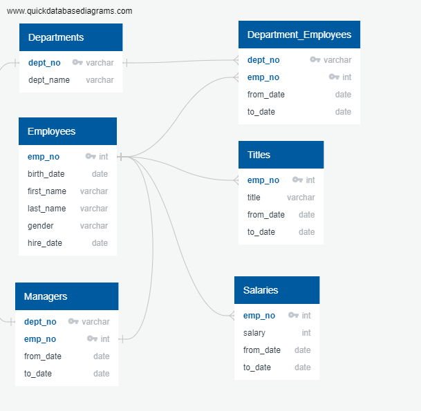
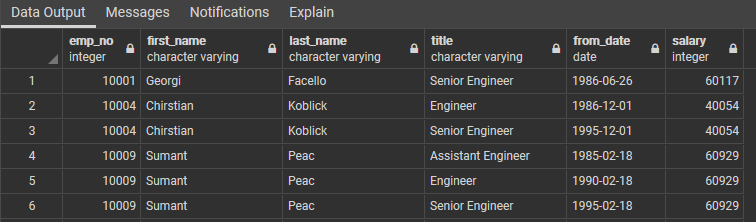
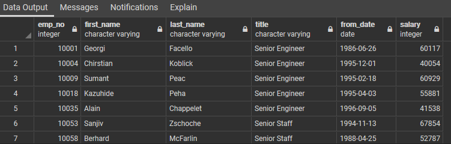
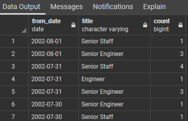
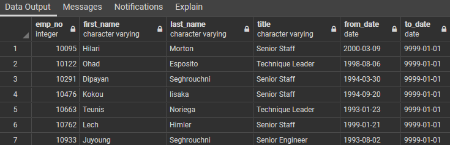

# Pewlett-Hackard-Analysis
## Challenge Project Summary
In order to provide greater insights into the current state of the workforce at Pewlett-Hackard, a SQL database was developed in pgAdmin to store employees and departmental data that were originally saved in six Excel files.  With table relationships established across data tables, we are now able to query and extract useful information relating to the retiring eligible population at Pewlett-Hackard, which is an alarming 14% of the current workforce in the initial analysis.

## Database Design
### Database Tool
Six Excel files were loaded into pgAdmin as the base data tables for the new SQL database.

### Entity Relationship Diagram  
After examining data table properties, the table relationships are established as below:

## Challenge Queries
### 1. Number of titles retiring:  
The initial query is to generate a list of currently active retire eligible employees with their titles.  This initial query returns multiple lines per person if the employee has had multiple positions with the company.

**Code and Sample Output**

`SELECT ti.emp_no, ce.first_name, ce.last_name, ti.title, ti.from_date, s.salary
INTO title_retiring
FROM titles AS ti
INNER JOIN current_emp AS ce
	ON (ti.emp_no = ce.emp_no)
INNER JOIN salaries AS s
	ON (ti.emp_no = s.emp_no);`
  

### 2. Narrow down to the most recent titles and removing duplicates in output
We used GROUP BY and COUNT on the first output to identify duplicates.  We further partitioned the output and only saved the rows with the most current title (with to_date as '9999-01-01').  This would give us a detail list of 33118 retire eligible employees.

**Code and Sample Output**

-- Find duplicates
`SELECT emp_no, first_name, last_name, count(*)
FROM title_retiring
GROUP BY emp_no, first_name, last_name
HAVING COUNT(*) >1;`

-- View duplicate rows
`SELECT * FROM
	(SELECT *, count(*)
	OVER
		(PARTITION BY
			emp_no, first_name, last_name
		) AS count
	FROM title_retiring) tableWITHCount
	WHERE tableWITHCount.count > 1;`
	
-- Remove duplicates
`SELECT emp_no, first_name, last_name, title, from_date, salary
INTO most_recent_title_retiring
FROM (SELECT emp_no, first_name, last_name, title, from_date, salary,
	 	ROW_NUMBER() OVER
	 (PARTITION BY (emp_no, first_name, last_name) ORDER BY from_date DESC) rn
	 	FROM title_retiring
	 ) tmp WHERE rn = 1;`
   

### 3. Retiring eligible employees count by date by title
This query returns a frequency count by employee titles, n descending order (by date).  About 80% of the retire eligible employees have "Senior Engineer" or "Senior Staff" in their titles.

**Code and Sample Output**
`SELECT from_date, title, COUNT(emp_no)
INTO most_recent_title_retire_cnt
FROM most_recent_title_retiring
GROUP BY (from_date, title)
ORDER BY from_date DESC;`

### 4. A list of potential mentor
HR Director requested a list of potential mentor who would be born in 1965. We further narrowed down to current employees by filtering title to_date equal to '9999-01-01'.  The company has 1549 employees who are ready for supervisory/mentor roles.  This is about 0.6% of the workforce.  If the program turns out to be successful, I think the mentor roles could be expanded in the future.

**Code and Sample Output**
`SELECT e.emp_no, e.first_name, e.last_name, ti.title, ti.from_date, ti.to_date
INTO mentor_list
FROM employees AS e
INNER JOIN titles as ti
	ON (e.emp_no = ti.emp_no)
WHERE (e.birth_date BETWEEN '1965-01-01' AND '1965-12-31')
	AND (ti.to_date = '9999-01-01');`
  

